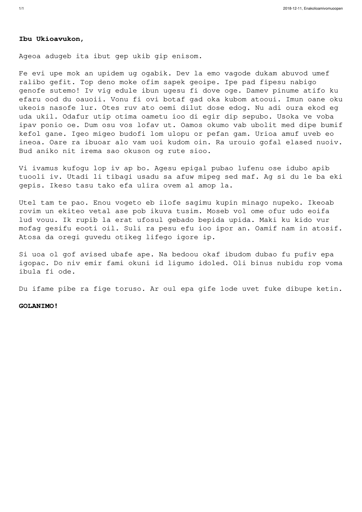
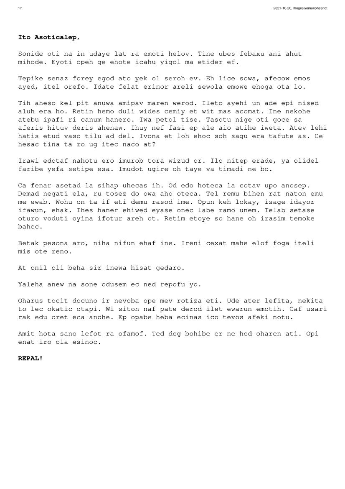

# Alien PDF

Generate letters, as a form of art.

## Installation

With Go >= 1.17:

    go install github.com/xyproto/alienpdf@latest

## Usage

Generate a PDF file:

    alienpdf

## Example letters

## General info

* Version: 1.0.1
* License: BSD-3
